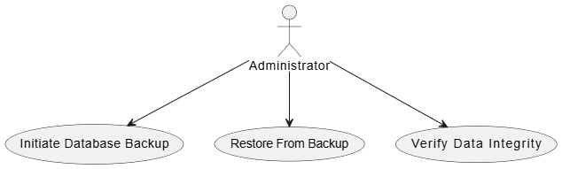

# Story 3: Oversee data storage and implement backup strategies.

**Issue:** [#6 “Oversee data storage and implement backup strategies”](https://github.com/Software-Engineering-Year-3/Environmental-Data-Monitor/issues/6)

## UML Class Diagram

## UML Use Case Diagram

## Code Files
- **BackupRecord.cs**  
   [View source](../ED_Monitor.Data/Models/BackupRecord.cs)

- **IBackupService.cs**  
  [View source](../ED_Monitor.Data/Data/Services/IBackupService.cs) 

- **FileSystemBackupService.cs**
  [View source](../ED_Monitor.Data/Data/Services/FileSystemBackupService.cs)  

- **BackupViewModel.cs**
  [View source](../ViewModels/BackupViewModel.cs)  
  
- **BackupPage.xaml.cs**
  [View source](../Pages/BackupPage.xaml.cs) 
    