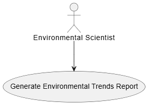

# Story 1: Generate Comprehensive Reports on Environmental Trends

**Issue:** [#4 “Generate Comprehensive Reports on Environmental Trends”](https://github.com/Software-Engineering-Year-3/Environmental-Data-Monitor/issues/4)

## UML Class Diagram

## UML Use Case Diagram

## Code Files
- **TrendData.cs**  
  [View source](../ED_Monitor.Data/Models/TrendData.cs)  

- **ITrendDataService.cs**  
  [View source](../ED_Monitor.Data/Data/Services/ITrendDataService.cs) 
  
- **TrendDataService.cs**
  [View source](../ED_Monitor.Data/Data/Services/TrendDataService.cs)  

- **IReportPdfGenerator.cs**
  [View source](../ED_Monitor.Data/Data/Services/IReportPdfGenerator.cs)  
  
- **ReportPdfGenerator.cs**
  [View source](../ED_Monitor.Data/Data/Services/ReportPdfGenerator.cs) 
  
- **ReportViewModel.cs**
  [View source](../ViewModels/ReportViewModel.cs) 
  
- **ReportPage.xaml.cs**
  [View source](../Pages/ReportPage.xaml.cs) 
  