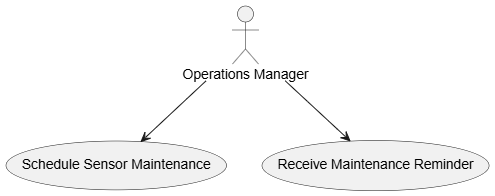

# Story 2: Schedule maintenance and ensure timely checks.

**Issue:** [#5 “Schedule maintenance and ensure timely checks”](https://github.com/Software-Engineering-Year-3/Environmental-Data-Monitor/issues/5)

## UML Class Diagram

## UML Use Case Diagram

## Code Files
- **MaintenanceTask.cs**  
   [View source](../ED_Monitor.Data/Models/TrendData.cs)

- **IMaintenanceService.cs**  
  [View source](../ED_Monitor.Data/Data/Services/IMaintenanceService.cs) 

- **InMemoryMaintenanceService.cs**
  [View source](../ED_Monitor.Data/Data/Services/InMemoryMaintenanceService.cs)  

- **INotificationService.cs**
  [View source](../ED_Monitor.Data/Data/Services/INotificationService.cs)  
  
- **LocalNotificationService.cs**
  [View source](../ED_Monitor.Data/Data/Services/LocalNotificationService.cs) 
  
- **MaintenanceViewModel.cs**
  [View source](../ViewModels/MaintenanceViewModel.cs) 
  
- **MaintenancePage.xaml.cs**
  [View source](../Pages/MaintenancePage.xaml.cs) 
    
